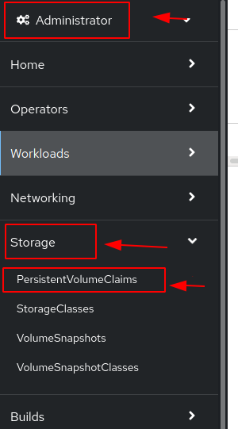
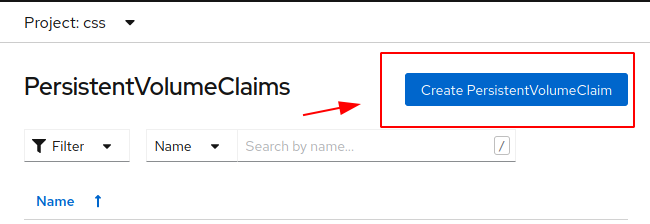
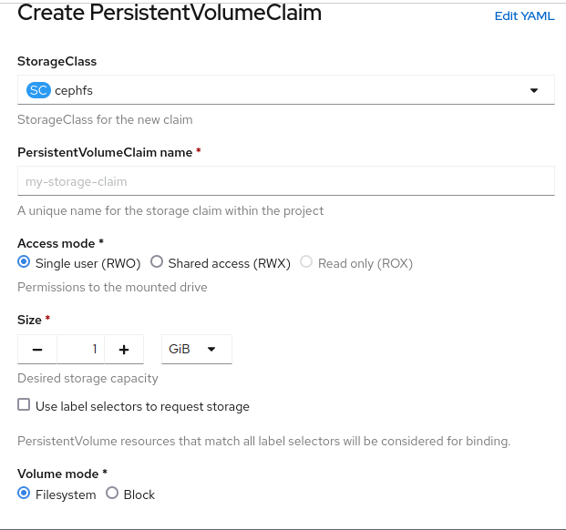
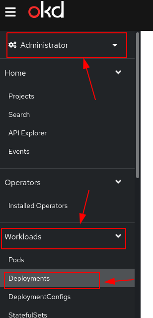
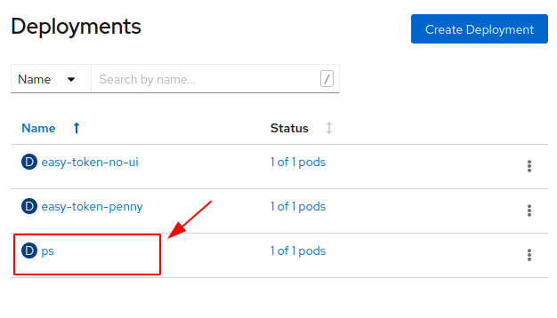
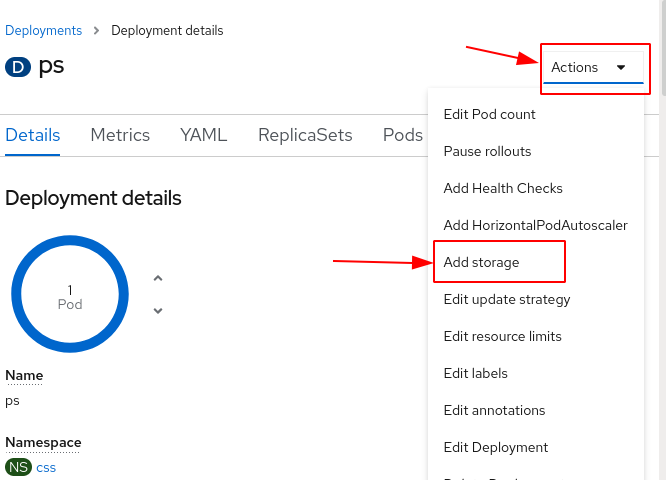
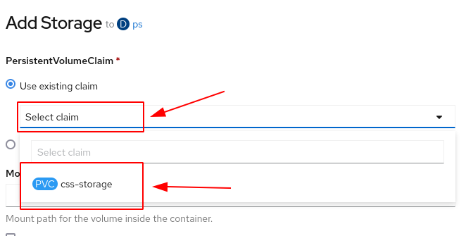

# Create a persistant volume (PV) on okd4

[CERN's documentation](https://paas.docs.cern.ch/3._Storage/persistent-storage/)

## Option1:  manually

### 1. create a volume

Login to okd at paas.cern.ch

 1. Administrator -> Storage -> PersistantVolumeClaim

 2. Create PersistantVolumeClaim:

 Select the following options:

    - StorageClass: cephfs
    - Access mode: Shared access (RWX)
    - Volume mode: Filesystem

### 2. mount volume to a given pod

 1. Administrator -> Workloads -> Deployments

  

 2. Select the deployment of the pod you want to attach the PV to

  

 3. On the right teardown "Actions" menu

   

 4. Select the previously created persistant volume claim ( PVC )

    

 5. Enter the path where you want the PV to be mounted and Save

    *for example `/var/css_storage/`*

## Option 2: with `oc` command line

 TODO
