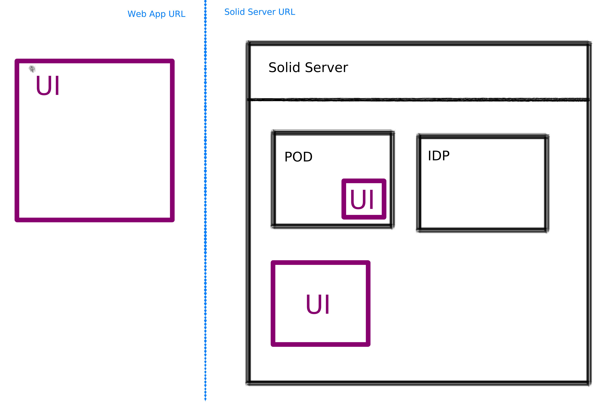

# Using CSS with a User Interface

CSS is a simple pod and ID provider, it doesn't has an UI that allows the user to interact with their pods.

Their is 3 options to have an UI on a CSS pod:

  1. using an external UI app
  2. extend CSS using components.js dependency injection framework with a UI
  3. uploading a UI in the pod 

Options 1 is the more stable solution for now, but it has the disavantage to have the pod UI on a different URL than the CSS instance, which can be confusing for the user.

In the oposite, option 2 and 3 have the advantages to live under the same URL as the CSS instance instance. Unfortunatly:

  - option 2 is only available with penny UI and is still buggy. To make it work with a UI other than penny, one needs to create a special CSS config file and resolve conflict that could be created between CSS and the UI, which might required a bit of work.
  - option 3 no solution yet for CSS, a solution exist with NSS and could be ported to CSS ( see Pod-homepage bellow ). Also, to allow a UI to run inside a Pod, the Pod need to be configured to interpret html and javascript. This can be a security issue, as it can allow scammers to create phishing webpage with the pod provider URL.

|                | Location*    | Author(s)       | Actively maintained    | Source code URL                                                     | Example URL                     |
|----------------|--------------|-----------------|------------------------|---------------------------------------------------------------------|---------------------------------|
| Pod-Browser    | External     | Inrupt          | Yes                    | https://github.com/inrupt/pod-browser                               | https://podbrowser.inrupt.com/  |
| Oh-my-pod      | External     | Empathy         | No ( since dec. 2020 ) | https://github.com/empathyco/solid-oh-my-pod                        | https://ohmypod.netlify.com/    |
| Penny          | External     | Vincent Tunru   | Yes                    | https://gitlab.com/vincenttunru/penny                               | https://penny.vincenttunru.com/ |
| Penny-recipe   | Solid-Server | Vincent Tunru   | Yes                    | https://github.com/solid/community-server-recipes/tree/main/penny   |                                 |
| Mashlib-recipe | Solid-Server | Solid community | Yes                    | https://github.com/solid/community-server-recipes/tree/main/mashlib |                                 |
| Pod-homepage   | Pod          | Angelo Veltens  | Yes                    | https://gitlab.com/angelo-v/pod-homepage                            | https://angelo.veltens.org/     |

*See locations on the above illustration

## Features

|                | Features                    | Comments |
|----------------|-----------------------------|----------|
| Penny          | Inspect and modify pod data | Build as a developper tool, but usable as UI.     The UI may seems complexe for non-technical users        |
| Oh-my-pod      | Inspect and modify pod data   Contact| Similar to Pod-browser, unmaintained         |
| Pod-Browser    | Inspect and modify pod data   Contact  Bookmarks| Simple UI intended for non-technical users        |
| Pod-homepage   | Profile page     Bookmarks   Blog                               |  Not compatible with CSS for now    But can be a good start for Pod based CSS UI     Not possible to modify pod's data for now   |

